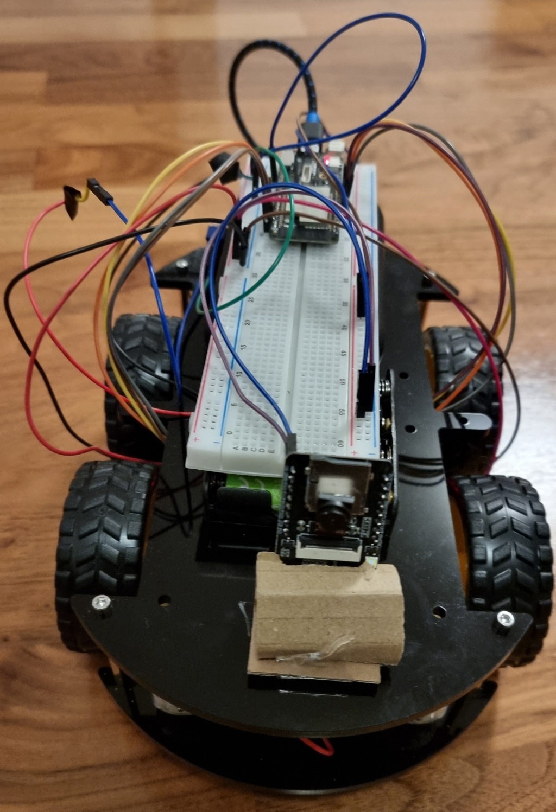

# Wifi Tank project

This project is an ESP32 Wifi-controlled tank/rover with a camera.



## Software

The project consists of three crates for the rover control board, a client on the host machine, and the camera board. All should be able to connect to the same Wifi network.

To build them install Rust and `espup` and run:

```bash
$ source ~/export-esp.sh
$ cargo run --release
```

### wifi_tank
Crate link: [wifi_tank](./wifi_tank/)

This crate contains the ESP32 code for the control board on the rover itself.
This should be flashed onto that board.

Your Wifi credentials should be added to `.cargo/config.toml` before building,
and use 2.5GHz Wifi and WPA2 personal authentication.

The rover will connect to the Wifi with the hostname `wifitank` and
listen for a UDP connection from the client on port 8080.

### wifi_tank_controller_client
Crate link: [wifi_tank_controller_client](./wifi_tank_controller_client/)

This client runs on the host machine connected to the same Wifi, and
communicates to the control board and camera board on the rover via
their hostnames (`wifitank` and `espressif` respectively).

It expects a USB gamepad for input and uses the Directional Pad for
controls.

### esp32cam
Crate link: [esp32cam](./esp32cam/)

This crate contains the ESP32 code for the ESP32-CAM module and should
be flashed onto the camera board (see below for flashing details). The
code serves a stream on HTTP at [http://espressif/camera](http://espressif/camera)
once connected to the Wifi.

This code is a modified version of [@Kezii's esp32cam_rs](https://github.com/Kezii/esp32cam_rs) crate.

Initialise the `esp32-camera` git submodule with:

```bash
$ git submodule update --init
```

The Wifi credentials should be added in `.cargo/config.toml` as for the the `wifi_tank` crate.

## Hardware

- Control board: Any ESP32 development board - although one with 5V
  output is preferable. A Lolin D32 Pro board was used in development
  (but this does not have 5V out). Note this code is written for ESP32 Qtensa
  boards but it should be simple to adapt for the ESP32-C series RISC-V based ones too.
- ESP32-CAM module.
- Any USB-UART adapter to flash the ESP32-CAM module.
- Any power bank to power the control board (via micro-USB).
- A 4-battery AA battery holder for powering the motors (I used
  rechargeable batteries).
- 4x L298N motor drivers (or any that will work with 3.3V control inputs)
- 4x DC Gearbox motors (I used the "TT Motor" ones)
- A robot car chassis (I used the Elegoo one, but you could also cut
  this from card).

### Flashing ESP32-CAM module

In order to flash the ESP32-CAM module you must connect the `IO0` pin to
the adjacent `GND` pin.

Then connect the UART adapter with the UART `TX` pin connecting to the `U0R`
pin on the ESP32-CAM, and the UART `RX` pin connecting to the `U0T` pin.
Use the 5V output on the UART adapter (if possible) to the 5V input on the ESP32-CAM,
and connect the ground from the UART adapter to the adjacent ground pin
next to the 5V input (do not use the `GND/R` reset pin as this keeps the
device resetting).

Once connected you must reset the ESP32-CAM with the reset button on the
board immediately before flashing, you then have ~2 seconds to start the
flashing process with espflash.

You can then connect it without the `IO0` jumper to test it (and see the serial output with `picom`).

### GPIO Pin setup

#### Control board (Lolin D32 Pro)

See [LastMinuteEngineers' Interface L298N DC Motor Driver Module with Arduino article](https://lastminuteengineers.com/l298n-dc-stepper-driver-arduino-tutorial/) for help with the Motor Driver pins.

Connect the ground pin of the control board to the shared ground connections of the motor drivers.

Left motor:

- Pin 13 to EN1
- Pin 12 to EN2
- Pin 26 to EN3
- Pin 25 to EN4


Right motor:

- Pin 21 to EN1
- Pin 19 to EN2
- Pin 22 to EN3
- Pin 23 to EN4

#### ESP32-CAM

Here the GPIO pins all dealt with internally and the board communciates over Wifi.

Connect the 5V input to a 5V source (e.g. from the UART converter or a 5V output from the control board if possible).
Connect the grounds with the 5V source.

Note you can use the 5V output from the L298N motor drivers, however at higher input voltages this is not guaranteed to be stable.

Note technically the ESP32-CAM also supports 3.3V input, but this is unreliable and often hits brownout issues when actually working.

Note this code requires SPI RAM to be enabled - `CONFIG_ESP32_SPIRAM_SUPPORT=y` in sdkconfig.defaults

## Possible improvements

- Support ESP BLE Provisioning for setting the Wifi credentials via BLE for both
  boards.
- Create a nostd version of the esp32cam crate.
- Motor speed control (use ENA and ENB pins with PWM).
- Test external antenna for ESP32-CAM

## Useful Resources

- [@flyaruu's esp32-nostd crate](https://github.com/flyaruu/esp32-nostd) - the best reference for nostd esp_wifi usage.
- [Floodplain's Rust on ESP32 no_std YouTube series](https://www.youtube.com/watch?v=o8yNNVFzNnM&list=PL0U7YUX2VnBFbwTi96wUB1nZzPVN3HzgS)
- [Embassy on ESP blog series](https://dev.to/theembeddedrustacean/embassy-on-esp-gpio-5594)
- [ESP32 Embedded Rust at the HAL blog series](https://blog.theembeddedrustacean.com/esp32-embedded-rust-at-the-hal-gpio-interrupts)
- [LastMinuteEngineers' in-depth L298N motor driver tutorial](https://lastminuteengineers.com/l298n-dc-stepper-driver-arduino-tutorial/)
- [Rust Networking with the Raspberry Pi Pico](https://murraytodd.medium.com/rust-networking-with-the-raspberry-pi-pico-w-002384a5954b)
- [Rust Client/Server Comms on the Raspberry Pi Pico](https://murraytodd.medium.com/client-server-comms-on-the-raspberry-pi-pico-w-b0767ecfb4dc)
- [IoT with Rust on ESP](https://dev.to/theembeddedrustacean/iot-with-rust-on-esp-connecting-wifi-4be6)
- [Connect ESP32 to Wifi with Rust](https://medium.com/@rajeshpachaikani/connect-esp32-to-wifi-with-rust-7d12532f539b)
- [LastMinuteEngineers' Getting Started with ESP32 CAM](https://lastminuteengineers.com/getting-started-with-esp32-cam/)
